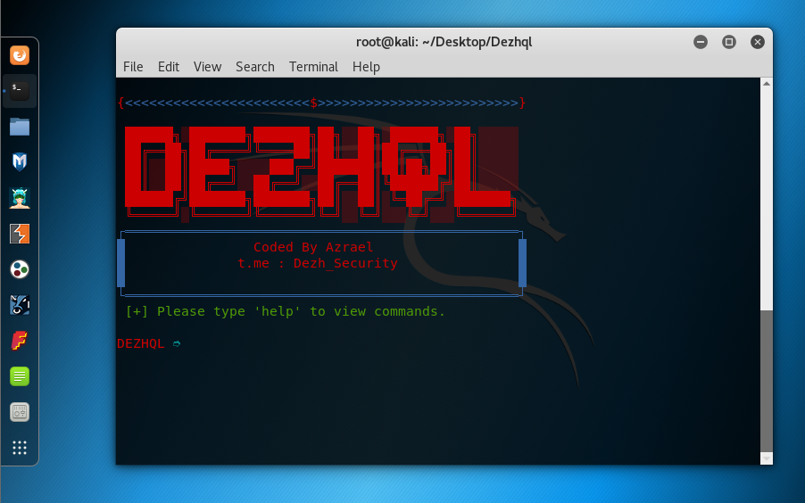
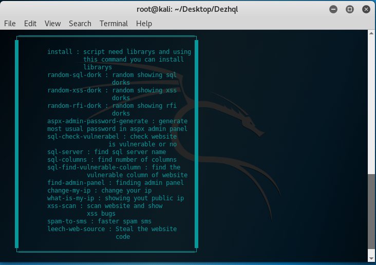

<!DOCTYPE html>

<html>
    <head>
        <meta charset="utf-8">
    </head>
    <body>
        <h1>
            Preview
        </h1>
        
        <h2>
            Install
        </h2>
        <ol>
            <li>
                cd <i>Dezhql</i>
            </li>
            <li>
                python3 <i>install.py</i>
            </li>
        </ol>
        <h2>
            Problems
        </h2>
        

            if you see this error: <b>bash: command: python3 not found</b> get install python3 using this command: <b>sudo apt-get install python3</b>  
        and please ask your more question in issues. 
        

        <h2>
            How to use?
        </h2>
        <ul>
            <li>
            python3 <i>Dezhql.py</i>
            </li>
        </ul>
        

            Then type 'help' to view commands.
        

        
        <h2>
            Commands
        </h2>
        <ol>
            <li>
                random-sql-dork <ul>
                    <li>show a random sql dorks</li>
                </ul>
            </li>  
            <li>
                random-xss-dork <ul>
                    <li>show a random xss dorks</li>
                </ul>
            </li>  
            <li>
                random-rfi-dork <ul>
                    <li>show a random rfi or lfi dorks</li>
                </ul>
            </li>  
            <li>
                aspx-admin-password-generate <ul>
                    <li>generate most usual passowrds in aspx admin panels</li>
                </ul>
            </li>  
            <li>
                sql-check-vulnerable <ul>
                    <li>check if web vulnerable (<b>sql</b>)</li>
                </ul>
            </li>  
            <li>
                sql-server <ul>
                    <li>find sql server name</li>
                </ul>
            </li>  
            <li>
                sql-columns <ul>
                    <li>find number of columns in vulnerable websites</li>
                </ul>
            </li>  
            <li>
                sql-find-vulnerable-column <ul>
                    <li>find vulnerable column in vulnerable websites</li>
                </ul>
            </li>  
            <li>
                find-admin-panel <ul>
                    <li>find a admin panels in websites</li>
                </ul>
            </li>  
            <li>
                change-my-ip <ul>
                    <li>can change your ip</li>
                </ul>
            </li>  
            <li>
                what-is-my-ip <ul>
                    <li>show your public ip</li>
                </ul>
            </li>  
            <li>
                xss-scan <ul>
                    <li>enter the website bug address and he can test payloads</li>
                </ul>
            </li>  
            <li>
                spam-to-sms <ul>
                    <li>the faster spam sms just enter phone number!</li>
                </ul>
            </li>  
            <li>
                leech-web-source <ul>
                    <li>steal the target website source code</li>
                </ul>
            </li>  
        </ol>
        <h2>Tested on</h2>
        <ul>
            <li>
                Kali linux
            </li>
            <li>
                Ubunto
            </li>
        <h2>
            Rules
        </h2>
            <ul>
                <li>Sql dork list by m0k1</li>
                <li>Xss dork list by google</li>
                <li>Xss payloads by payloadbox</li>
            </ul>
        <h2>
            License
        </h2>
        <ul>
            <li>
                MIT
            </li>
        </ul>
    </body>
</html>
